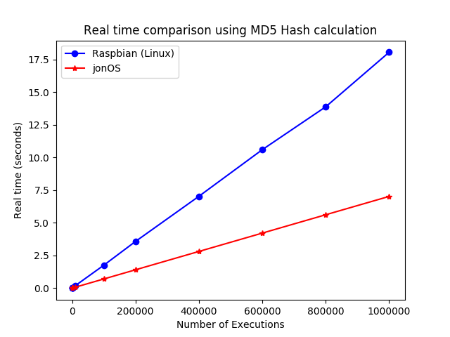
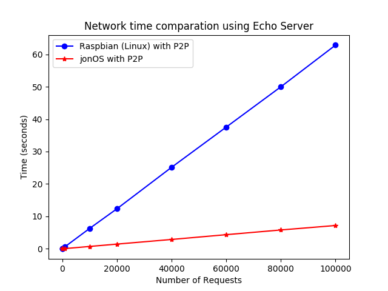

jonOS is a basic OS for Raspberry Pi (ARM) that allows build embedded systems for high performance environments.

This project defines a new architecture for operating systems that takes the main characteristics of other architectures such as Embedded OS, OS as library, High Performance OS, monotasking OS and mix it with the idea os a iterative server. 

The performance results of this architecture compared with Rasbian (Debian based OS designed for Raspberry Pi) achieve the following times in CPU time, real time and network time:






## Compile jonOS

To compile jonOS use the make utility in the root folder:
```
make
```

## Prepare the SD Card

In the SD Card boot partition introduce following files after compile the kernel:

- boot/bootcode.bin
- boot/cmdline.txt
- kernel.img

## Send functions

The function has to be programed in the file *client/binary_function.c* and replace *IP* and *PORT* fields in the file *client/sender.py* with the IP and PORT that has been configured in jonOS.
